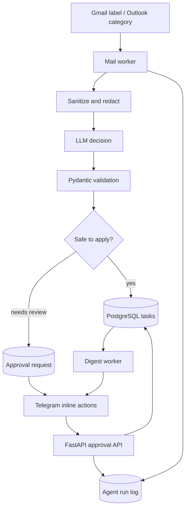

# Mail Task Agent

AI backend that turns incoming email into structured tasks, asks for human confirmation when a decision is ambiguous, and keeps an audit trail of every agent run.

The project is built around a simple product idea: **an LLM may interpret email, but potentially unsafe or uncertain actions should remain observable and controllable by the user**.

`FastAPI` · `LangGraph` · `PostgreSQL` · `SQLAlchemy 2` · `Alembic` · `Gmail API` · `Microsoft Graph` · `Telegram Bot API` · `Docker`

## What it does

The agent can:

- read selected Gmail or Outlook messages;
- sanitize and redact email content before model processing;
- classify an email and decide whether it creates, updates, or refers to a task;
- validate the LLM response with Pydantic schemas;
- create or update persistent tasks in PostgreSQL;
- request confirmation through Telegram for low-confidence or ambiguous decisions;
- keep `AgentRun`, task-event, email and approval history;
- send task digests through a separate worker;
- support both a simple single-user setup and a multi-user onboarding flow with OAuth-connected mail accounts.

The current MVP intentionally does **not** automatically send replies, archive mail, or delete messages.

## Processing flow



## Engineering decisions

### Human in the loop

The model does not get unrestricted access to mailbox actions. Review is required for:

- low-confidence decisions;
- explicit `request_review` decisions;
- proposed task completion;
- ambiguous task updates;
- future potentially destructive actions.

Telegram approvals are handled through explicit actions such as **Approve**, **Edit**, **Reject** and **Open email**.

### Safe-by-default execution

The default configuration is intentionally restrictive:

```env
SAFE_MODE=true
DRY_RUN=true
GMAIL_QUERY=label:AI_TEST -label:AI/Processed
```

With `DRY_RUN=true`, the system can read selected mail, call the configured LLM provider and write an `AgentRun`, but it does not apply Gmail labels, create real tasks or send real approval messages.

### Idempotency and recovery

- repeated processing of the same Gmail message does not create duplicate work;
- approval callbacks are idempotent;
- processing errors are persisted in `agent_runs.error`;
- in working mode, final processing errors can be marked with an error label/category;
- task changes are recorded as task events rather than being silently overwritten.

### Privacy-oriented storage

The full email body is not stored by default. `email_messages` keeps metadata together with a `body_hash`.

OAuth credentials for connected mail accounts are stored encrypted in `mail_accounts.encrypted_token`; encryption is configured with `TOKEN_ENCRYPTION_KEY`.

## Product modes

### Single-user mode

Useful for local development and personal testing. Credentials and the selected provider are configured through `.env`.

### Multi-user foundation

The repository also contains the base flow for a product-style setup:

1. a Telegram user receives an onboarding link;
2. the user opens the web onboarding page;
3. Gmail or Outlook is connected through OAuth;
4. the encrypted token/cache is stored for that user;
5. workers process active mail accounts independently;
6. LLM calls are performed only by the backend using the service API key.

This is a foundation rather than a finished SaaS product: billing, durable LangGraph resume and several production hardening steps are intentionally outside the current MVP.

## Stack

**Backend and workflow**

- Python 3.12+
- FastAPI
- Pydantic / pydantic-settings
- LangGraph workflow layer

**Persistence**

- PostgreSQL
- SQLAlchemy 2 async
- Alembic
- asyncpg / psycopg

**Integrations**

- Gmail API + Google OAuth
- Outlook / Microsoft Graph + MSAL
- Telegram Bot API
- DeepSeek through an OpenAI-compatible client
- OpenModel through an Anthropic-compatible client

**Engineering**

- Docker / Docker Compose
- pytest / pytest-asyncio
- Ruff
- Caddy configuration and deployment notes

## Repository structure

```text
app/
  api/            FastAPI endpoints
  agent/          decision schemas, prompts and routing
  db/             models and repositories
  integrations/   Gmail, Outlook, LLM and Telegram clients
  services/       email processing, tasks, approvals and digest logic
  workers/        mail polling, Telegram callbacks and digest workers
alembic/           database migrations
tests/             integration/service tests
Dockerfile
docker-compose.yml
DEPLOY.md
pyproject.toml
.env.example
```

## Data model

Alembic migrations create the main entities:

- `users`
- `telegram_identities`
- `mail_accounts`
- `user_settings`
- `oauth_states`
- `email_threads`
- `email_messages`
- `tasks`
- `task_events`
- `approval_requests`
- `agent_runs`

The separation between source email, agent decision, approval and task state makes the workflow auditable and easier to recover after failures.

## Quick start

### 1. Install

```bash
python -m pip install -e ".[dev]"
cp .env.example .env
```

Fill the required credentials in `.env`.

### 2. Prepare the database

```bash
alembic upgrade head
```

### 3. Start the API

```bash
uvicorn app.main:app --reload
```

Or start the base Docker Compose stack:

```bash
docker compose up --build
```

The default Compose setup starts PostgreSQL, a one-shot migration service and the API. Mail, Telegram and digest workers are kept in a separate `workers` profile so onboarding can be started before mail accounts are connected.

```bash
docker compose --profile workers up --build
```

## Mail providers

### Gmail

For web onboarding, create a Google OAuth client and configure:

```text
http://localhost:8000/oauth/gmail/callback
```

The required Gmail scope is:

```text
https://www.googleapis.com/auth/gmail.modify
```

The agent uses it for reading messages and managing its own AI labels. Sending, deleting and archiving are not part of the MVP.

For a safe first run, create an `AI_TEST` label and mark only a test message with it.

### Outlook / Microsoft Graph

Outlook uses Microsoft Graph categories instead of Gmail labels. Example configuration:

```env
MAIL_PROVIDER=outlook
MICROSOFT_CLIENT_ID=
MICROSOFT_TENANT_ID=common
MICROSOFT_TOKEN_CACHE_FILE=/app/secrets/ms_token_cache.bin
MICROSOFT_SCOPES=User.Read Mail.ReadWrite offline_access
OUTLOOK_CATEGORY=AI_TEST
OUTLOOK_PROCESSED_CATEGORY=AI_Processed
```

The implementation supports categories such as `AI_TEST`, `AI_Task`, `AI_Waiting`, `AI_Review`, `AI_Info`, `AI_Processed` and `AI_Error`.

## LLM providers

Provider selection is configured through:

```env
LLM_PROVIDER=deepseek
```

Supported implementations:

- `deepseek` — OpenAI-compatible chat-completions client;
- `openmodel` — Anthropic-compatible messages client.

The model response must pass Pydantic JSON validation. If the response is invalid, one retry is performed instead of silently accepting malformed output.

## Telegram approvals

Configure:

```env
TELEGRAM_BOT_TOKEN=
TELEGRAM_ALLOWED_USER_ID=
```

Without `TELEGRAM_ALLOWED_USER_ID`, the single-user Telegram worker stays inactive. Approval callbacks are accepted only for the configured user in this mode.

The multi-user flow links Telegram identity and mailbox onboarding through a backend-generated token.

Example:

```bash
curl -X POST http://localhost:8000/telegram/link-token \
  -H "X-API-Key: <ADMIN_API_KEY>" \
  -H "Content-Type: application/json" \
  -d '{"telegram_user_id":"123","chat_id":"123","username":"alice"}'
```

## API examples

Main endpoints include:

```text
GET  /health
GET  /ready
GET  /tasks
GET  /tasks/{task_id}
GET  /runs
GET  /approvals
POST /emails/{gmail_message_id}/process
POST /approvals/{approval_id}/approve
POST /approvals/{approval_id}/reject
POST /approvals/{approval_id}/edit
```

Administrative endpoints use:

```text
X-API-Key: <ADMIN_API_KEY>
```

A temporary onboarding URL can also be created directly:

```bash
curl -X POST http://localhost:8000/onboarding/new
```

## Tests and code quality

The test suite uses mocked/local dependencies rather than real Gmail, LLM or Telegram calls. It covers areas including email processing, Gmail history handling, Outlook, IMAP, onboarding, routing, task persistence and Telegram integration.

```bash
pytest
ruff check .
ruff format --check .
```

## Deployment

A more detailed deployment checklist is available in [`DEPLOY.md`](DEPLOY.md). The repository includes Docker, Compose and Caddy configuration for running the service behind a public HTTPS endpoint.

## Current MVP limitations

- Gmail uses polling rather than push notifications;
- attachments are not passed to the LLM;
- Telegram **Edit** leaves the approval for explicit editing through the API;
- LangGraph is currently used as the workflow/orchestration layer rather than a fully durable resume engine;
- automatic email replies, deletion and archiving are intentionally disabled.

These constraints are deliberate: the current version focuses on **reliable interpretation, persistent state, explicit approvals and recoverable backend behavior** before expanding the set of autonomous actions.
