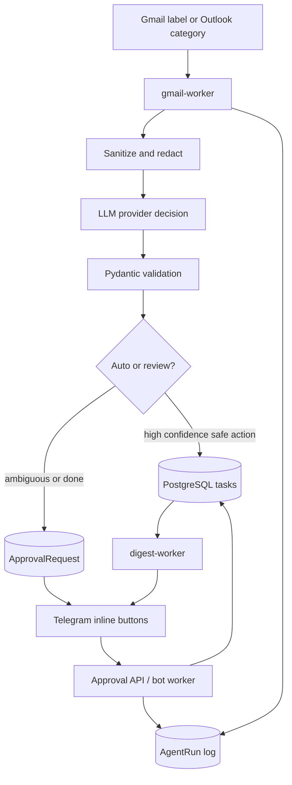

# mail-task-agent

MVP ИИ-агента для обработки Gmail-почты, создания и обновления задач, ведения журнала решений и запроса подтверждений через Telegram. Проект построен на FastAPI, LangGraph, SQLAlchemy 2, Alembic, PostgreSQL, DeepSeek direct или OpenModel gateway, Gmail API и Telegram Bot API.

По умолчанию агент запускается в безопасном режиме:

- читает только письма по запросу `label:AI_TEST -label:AI/Processed` для Gmail
  или с категорией `AI_TEST` для Outlook;
- не меняет Gmail при `DRY_RUN=true`;
- не создаёт реальные задачи при `DRY_RUN=true`;
- никогда не удаляет, не архивирует и не отправляет письма автоматически.

## Product Mode

Проект теперь поддерживает два режима:

- single-user режим через `.env`, удобный для локальной проверки;
- multi-user foundation: пользователь приходит из Telegram или web onboarding,
  подключает Gmail/Outlook через OAuth, а LLM вызывается только backend-сервисом
  через ваш API key.

Рекомендуемый продуктовый сценарий:

1. Telegram bot вызывает `POST /telegram/link-token` для пользователя.
2. Backend возвращает onboarding URL.
3. Пользователь открывает web onboarding.
4. Пользователь подключает Gmail или Outlook через OAuth.
5. Refresh/token cache шифруется и хранится в `mail_accounts`.
6. Worker обходит активные `mail_accounts` и обрабатывает почту каждого
   пользователя отдельно.

## Архитектура



Основные слои:

- `app/integrations`: Gmail, Outlook/Microsoft Graph, DeepSeek direct, OpenModel,
  Telegram clients.
- `app/services`: обработка писем, задачи, approvals, дайджест, редактирование текста.
- `app/agent`: Pydantic-схемы решения, prompt, routing, LangGraph skeleton.
- `app/db`: SQLAlchemy-модели и репозитории.
- `app/api`: FastAPI endpoints.
- `app/workers`: Gmail polling, Telegram callback polling, daily digest.

## Структура

```text
app/
  api/
  agent/
  db/
  integrations/
  services/
  workers/
alembic/
tests/
Dockerfile
docker-compose.yml
pyproject.toml
.env.example
Makefile
```

## Настройка

1. Установите Python 3.12+.
2. Создайте `.env`:

```bash
cp .env.example .env
```

3. Заполните секреты:

- `DEEPSEEK_API_KEY`: ключ DeepSeek direct provider.
- `OPENMODEL_API_KEY`: ключ OpenModel, если используете `LLM_PROVIDER=openmodel`.
- `MICROSOFT_CLIENT_ID`: application client id, если используете
  `MAIL_PROVIDER=outlook`.
- `TELEGRAM_BOT_TOKEN`: токен бота от BotFather.
- `TELEGRAM_ALLOWED_USER_ID`: ваш Telegram user id.
- `ADMIN_API_KEY`: ключ для административных API.
- `GOOGLE_CLIENT_SECRET_FILE`: путь к OAuth client secret JSON.
- `GOOGLE_TOKEN_FILE`: путь для сохранённого Gmail OAuth token.

## Gmail OAuth

1. В Google Cloud Console создайте проект.
2. Включите Gmail API.
3. Настройте OAuth consent screen и добавьте свой аккаунт в Test users.
4. Создайте OAuth Client ID типа Web application.
5. Добавьте Authorized redirect URI: `http://localhost:8000/oauth/gmail/callback`.
6. Скачайте client secret JSON в `secrets/google_client_secret.json`.
7. Создайте ссылку через `POST /onboarding/new`, откройте её и выберите Gmail.

Для production добавьте HTTPS callback вида
`https://<ваш-домен>/oauth/gmail/callback` и замените `APP_BASE_URL`.

В single-user режиме без web onboarding можно использовать Desktop OAuth client:
при первом запуске `gmail-worker` откроет локальный OAuth flow и сохранит token в `GOOGLE_TOKEN_FILE`.

Нужный scope: `https://www.googleapis.com/auth/gmail.modify`. Агент использует его для чтения и добавления AI-ярлыков, но не удаляет письма и не отправляет ответы.

## Outlook / Microsoft Graph

Outlook включается через Microsoft Graph Mail API:

```env
MAIL_PROVIDER=outlook
MICROSOFT_CLIENT_ID=
MICROSOFT_TENANT_ID=common
MICROSOFT_TOKEN_CACHE_FILE=/app/secrets/ms_token_cache.bin
MICROSOFT_SCOPES=User.Read Mail.ReadWrite offline_access
OUTLOOK_CATEGORY=AI_TEST
OUTLOOK_PROCESSED_CATEGORY=AI_Processed
```

Для получения `MICROSOFT_CLIENT_ID`:

1. Откройте Microsoft Entra admin center.
2. Перейдите в App registrations -> New registration.
3. Для личной Outlook/Hotmail почты выберите аккаунты Microsoft personal accounts
   или multi-tenant + personal accounts.
4. Скопируйте Application (client) ID.
5. В API permissions добавьте delegated permissions:
   `User.Read`, `Mail.ReadWrite`, `offline_access`.

При первом запуске worker создаст device-code flow и выведет в лог ссылку и код.
После входа токен сохранится в `MICROSOFT_TOKEN_CACHE_FILE`.

Outlook не использует Gmail labels. Вместо них агент создаёт и применяет
категории:

- `AI_TEST`
- `AI_Task`
- `AI_Waiting`
- `AI_Review`
- `AI_Info`
- `AI_Processed`
- `AI_Error`

## Telegram

1. Создайте бота через BotFather.
2. Укажите `TELEGRAM_BOT_TOKEN`.
3. Узнайте свой numeric user id и укажите `TELEGRAM_ALLOWED_USER_ID`.

Без `TELEGRAM_ALLOWED_USER_ID` Telegram worker остаётся неактивным.

Бот принимает callbacks только от разрешённого пользователя. Кнопки approval: `Подтвердить`, `Изменить`, `Отклонить`, `Открыть письмо`.

## LLM provider

Провайдер выбирается через:

```env
LLM_PROVIDER=deepseek
```

Поддерживаются:

- `deepseek`: прямой DeepSeek OpenAI-compatible Chat Completions client через пакет `openai`.
- `openmodel`: OpenModel gateway через Anthropic-compatible Messages API и пакет `anthropic`.

### DeepSeek direct

DeepSeek вызывается официальным пакетом `openai`:

```env
LLM_PROVIDER=deepseek
DEEPSEEK_BASE_URL=https://api.deepseek.com
DEEPSEEK_MODEL=deepseek-v4-flash
```

### OpenModel gateway

OpenModel вызывается отдельным анализатором `OpenModelAnalyzer` через `AsyncAnthropic.messages.create`.

```env
LLM_PROVIDER=openmodel
OPENMODEL_API_KEY=om-...
OPENMODEL_BASE_URL=https://api.openmodel.ai
OPENMODEL_MODEL=deepseek-v4-flash
OPENMODEL_MAX_TOKENS=2048
```

Имя модели полностью задаётся через env. Ответ LLM валидируется как JSON через Pydantic; при невалидном JSON выполняется одна повторная попытка.

## Запуск

Локально:

```bash
python -m pip install -e ".[dev]"
alembic upgrade head
uvicorn app.main:app --reload
```

Через Docker Compose:

```bash
docker compose up --build
```

По умолчанию Compose запускает `postgres`, одноразовый `migrate` и `api`.
Почтовый worker, Telegram bot и digest worker вынесены в профиль `workers`,
чтобы onboarding/API можно было поднять до подключения почтовых аккаунтов.

Запустить воркеры:

```bash
docker compose --profile workers up --build
```

Остановить:

```bash
docker compose down
```

API:

- `GET /health`
- `GET /ready`
- `GET /tasks`
- `GET /tasks/{task_id}`
- `GET /runs`
- `GET /approvals`
- `POST /emails/{gmail_message_id}/process`
- `POST /approvals/{approval_id}/approve`
- `POST /approvals/{approval_id}/reject`
- `POST /approvals/{approval_id}/edit`

Для административных endpoints передавайте:

```bash
X-API-Key: <ADMIN_API_KEY>
```

## Первый безопасный прогон

1. Оставьте:

```env
SAFE_MODE=true
DRY_RUN=true
GMAIL_QUERY=label:AI_TEST -label:AI/Processed
```

2. Для Gmail создайте ярлык `AI_TEST` и пометьте одно тестовое письмо.
3. Для Outlook поставьте письму категорию `AI_TEST`.
4. Запустите:

```bash
docker compose up --build
```

При `DRY_RUN=true` агент может читать Gmail, вызывать выбранный LLM provider и писать `AgentRun`, но не добавляет Gmail-ярлыки, не создаёт реальные задачи и не отправляет реальные approval-сообщения.

Чтобы включить рабочий режим, установите:

```env
DRY_RUN=false
```

Оставьте `SAFE_MODE=true`, пока не убедитесь, что `GMAIL_QUERY` ограничен тестовым ярлыком.

## Тесты и качество

Тесты не используют реальные Gmail, DeepSeek/OpenModel или Telegram:

```bash
pytest
ruff check .
ruff format --check .
```

В этом репозитории проверки были запущены через Python 3.13, потому что локальный `python` был 3.10, а Python 3.12 не установлен.

## Модель данных

Alembic migration создаёт:

- `email_threads`
- `email_messages`
- `tasks`
- `task_events`
- `approval_requests`
- `agent_runs`
- `users`
- `telegram_identities`
- `mail_accounts`
- `user_settings`
- `oauth_states`

Полный текст письма по умолчанию не хранится. В `email_messages` сохраняются metadata и `body_hash`.

OAuth-токены почты хранятся в `mail_accounts.encrypted_token`. Для шифрования
обязательно задайте:

```env
TOKEN_ENCRYPTION_KEY=
```

Сгенерировать ключ:

```bash
python -c "from cryptography.fernet import Fernet; print(Fernet.generate_key().decode())"
```

## Web Onboarding

Создать временную web-ссылку без Telegram:

```bash
curl -X POST http://localhost:8000/onboarding/new
```

Создать ссылку для пользователя Telegram, этот endpoint должен вызывать ваш bot
backend:

```bash
curl -X POST http://localhost:8000/telegram/link-token \
  -H "X-API-Key: <ADMIN_API_KEY>" \
  -H "Content-Type: application/json" \
  -d '{"telegram_user_id":"123","chat_id":"123","username":"alice"}'
```

Ответ содержит:

```json
{
  "link_token": "...",
  "onboarding_url": "http://localhost:8000/onboarding/..."
}
```

Пользователь открывает `onboarding_url` и выбирает Gmail или Outlook.

Для OAuth callback в Google/Microsoft укажите:

```text
http://localhost:8000/oauth/gmail/callback
http://localhost:8000/oauth/outlook/callback
```

В продакшене замените `APP_BASE_URL` на публичный HTTPS-домен.

## Что требует подтверждения

Подтверждение требуется для:

- низкой уверенности модели;
- `request_review`;
- любого предложения перевести задачу в `done`;
- неоднозначных обновлений задачи;
- будущих опасных действий вроде отправки письма, архивации или удаления.

Удаление, архивирование и автоматическая отправка ответов в MVP не реализованы намеренно.

## Восстановление после ошибок

- Ошибки обработки сохраняются в `agent_runs.error`.
- В рабочем режиме при финальной ошибке агент пытается добавить Gmail-ярлык `AI/Error`.
- Повторная обработка уже обработанного `gmail_message_id` не создаёт дубликаты.
- Approval callback идемпотентен: повторное нажатие не применяет действие дважды.

## Ограничения MVP

- Gmail push notifications не подключены; используется polling, но бизнес-логика отделена от polling worker.
- Вложения не передаются в LLM.
- Telegram `Изменить` в polling worker оставляет approval на ручное редактирование через API `POST /approvals/{id}/edit`.
- LangGraph подключён как workflow layer/skeleton; durable resume можно расширить поверх `ApprovalRequest.langgraph_thread_id`.
- Автоматические ответы на письма, удаление и архивация отключены.
